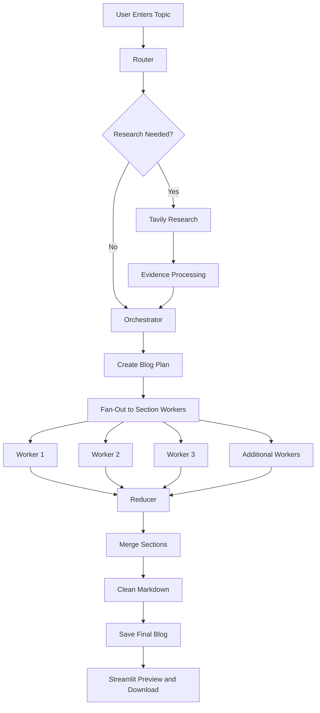

# ✍️ AI Blog Writing Agent

An intelligent technical blog-generation system built with **LangGraph**, **OpenAI**, **Tavily**, and **Streamlit**.

The application analyzes a topic, decides whether current research is required, creates a structured blog plan, writes sections in parallel, merges them into one cohesive article, and produces clean Markdown that is ready to publish.

---

## 🚀 Project Overview

Writing a strong technical article usually requires several separate steps:

1. Understanding the topic
2. Deciding whether current research is needed
3. Creating a logical outline
4. Writing each section
5. Adding reliable sources
6. Editing the final article
7. Exporting it in a publishable format

This project automates that workflow through a multi-agent architecture.

Instead of sending one large prompt to a language model, the system divides the writing process into specialized nodes. Each node has a clear responsibility, making the workflow easier to understand, extend, and maintain.

---

## ✨ Key Features

* **Intelligent topic routing**

  * Determines whether a topic is evergreen or requires current web research
  * Supports closed-book, hybrid, and open-book writing modes

* **Automatic research**

  * Uses Tavily to find relevant web sources when research is needed
  * Filters and organizes evidence before writing begins
  * Prevents unsupported current claims from being added to the article

* **Structured blog planning**

  * Creates a complete blog outline
  * Defines section goals, key points, word counts, tags, and citation requirements

* **Parallel section generation**

  * Uses LangGraph fan-out workers to write multiple sections
  * Preserves the correct section order during final assembly

* **Clean, publishable output**

  * Removes internal workflow messages, placeholders, and API errors
  * Produces a complete Markdown article ready for GitHub, Medium, Hashnode, Dev.to, or a personal website

* **Interactive Streamlit interface**

  * Enter a topic and generate a blog from the browser
  * View the plan, evidence, final article, and workflow logs
  * Download the finished article as a Markdown file
  * Load previously generated blogs

* **Automatic local storage**

  * Saves generated articles inside the `generated_blogs` directory

---

## 🧠 Workflow Architecture



---

## 🔀 Research Modes

The router classifies each topic into one of three modes.

### Closed-Book Mode

Used for stable, evergreen topics that do not require recent information.

Examples:

* Introduction to linked lists
* How recursion works
* Object-oriented programming principles

### Hybrid Mode

Used for topics that combine stable concepts with recent tools, models, or industry examples.

Examples:

* Best practices for deploying AI applications
* Modern RAG system architecture
* Current tools for machine learning monitoring

### Open-Book Mode

Used for highly time-sensitive topics.

Examples:

* AI news from the past week
* Recent model releases
* Current technology policy changes
* Recent company announcements

---

## 🛠️ Technology Stack

| Technology | Purpose                                            |
| ---------- | -------------------------------------------------- |
| Python     | Core programming language                          |
| LangGraph  | Multi-step agent workflow and state management     |
| LangChain  | LLM messages, tools, and integrations              |
| OpenAI     | Routing, planning, research synthesis, and writing |
| Tavily     | Web research and source discovery                  |
| Pydantic   | Structured and validated model outputs             |
| Streamlit  | Interactive web interface                          |
| Pandas     | Displaying plans and evidence in tables            |
| Markdown   | Final publishable blog format                      |

---


---

## ⚙️ Installation

### 1. Clone the repository

```bash
git clone https://github.com/YOUR-USERNAME/YOUR-REPOSITORY-NAME.git
cd YOUR-REPOSITORY-NAME
```

### 2. Create a virtual environment

#### Windows PowerShell

```powershell
python -m venv venv
venv\Scripts\Activate.ps1
```

#### macOS or Linux

```bash
python3 -m venv venv
source venv/bin/activate
```

### 3. Install the dependencies

```bash
pip install -r requirements.txt
```

---

## 🔐 Environment Variables

Create a `.env` file in the project root:

```env
OPENAI_API_KEY=your_openai_api_key
TAVILY_API_KEY=your_tavily_api_key
```

The OpenAI API key is required for the main AI workflow.

The Tavily API key is required for topics that need current web research.

> Never upload your `.env` file or API keys to GitHub.

---

## ▶️ Run the Application

Start the Streamlit application:

```bash
streamlit run bwa_app.py
```

Streamlit will display a local address similar to:

```text
http://localhost:8501
```

Open the address in your browser.

---

## 📝 How to Use

1. Enter a technical blog topic in the sidebar.
2. Select the appropriate as-of date.
3. Click **Generate Blog**.
4. Follow the workflow progress.
5. Review the generated plan.
6. Review the research evidence when available.
7. Open the **Final Blog** tab.
8. Download the clean Markdown article.


## 📤 Output

Generated articles are automatically saved as Markdown files:

```text
generated_blogs/blog_title.md
```

The final output contains:

* A clear title
* Organized headings
* Complete explanatory paragraphs
* Lists and code examples when appropriate
* Research links when citations are required

The Markdown can be used directly on:

* GitHub
* Medium
* Hashnode
* Dev.to
* Notion
* Documentation websites
* Personal portfolios

---

## 🧩 Main LangGraph Nodes

### Router

Analyzes the topic and selects the appropriate research mode.

### Research Node

Searches for relevant sources using Tavily and converts the results into structured evidence.

### Orchestrator

Creates the complete blog plan, including section titles, goals, bullet points, word counts, and requirements.

### Worker Nodes

Generate individual blog sections. Multiple workers can run through LangGraph's fan-out pattern.

### Reducer

Sorts and combines all generated sections into one article.

### Markdown Cleaner

Removes internal messages, image-generation failures, placeholders, invalid control characters, and unnecessary blank lines.

### Save Node

Stores the final article inside the `generated_blogs` directory.

---

## 💡 Engineering Concepts Demonstrated

This project demonstrates practical experience with:

* Agentic AI workflows
* LangGraph state management
* Conditional routing
* Multi-agent orchestration
* Parallel task execution
* Structured LLM outputs
* Pydantic validation
* Retrieval and research pipelines
* Prompt engineering
* Evidence-grounded generation
* Error handling
* Markdown post-processing
* Streamlit application development
* Environment-variable management
* Modular Python design

---

## 🛡️ Reliability and Safety Measures

The system includes several controls to improve output quality:

* Current claims must be connected to supplied research evidence
* Unsupported claims are omitted instead of invented
* Search results are deduplicated by URL
* Publication dates are not guessed
* Worker outputs follow a defined Markdown format
* Final sections are sorted before merging
* Environment variables keep API keys outside the source code

---

## 🔮 Future Improvements

Potential future enhancements include:

* Human approval before final article generation
* Blog editing and regeneration by section
* Citation formatting in APA or IEEE style
* Export to PDF and DOCX
* Direct publishing to Medium or WordPress
* User-selectable writing tones
* SEO title and keyword generation
* Automatic meta descriptions
* Fact-checking and citation verification
* Multiple language support
* Database storage for generated articles
* User authentication
* Cloud deployment

---


## 🎯 Why I Built This Project

I built this project to explore how agentic AI systems can manage complex content-generation workflows more reliably than a single prompt.

The project helped me practice designing specialized agents, managing shared state, performing conditional research, generating structured outputs, coordinating parallel workers, and building an interactive application around an AI workflow.

It also reflects my interest in AI engineering, retrieval-augmented systems, production-oriented LLM applications, and practical automation.

---

## 👩‍💻 Author

**Samia Tabassum**

Computer Science student and aspiring AI Engineer with interests in:

* Generative AI
* Retrieval-Augmented Generation
* AI agents
* Machine learning
* Cloud computing
* Production AI systems

---

## 📄 License

This project is available for educational and portfolio purposes.


---

## ⭐ Support

If you find this project useful, consider giving the repository a star.

Feedback, suggestions, and contributions are welcome.
